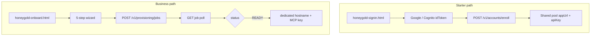

# HoneyGold customer onboarding — delivery plan

This document tracks **HoneyGold SaaS onboarding**: instant **Starter** enroll on a shared pool, and **Business / Enterprise** dedicated-stack provisioning. Pricing is **3 tiers** (Starter free, Business ~€699/mo, Enterprise contact us). All list prices are in **EUR**. **AI access** is via **Claude Desktop + HoneyGold MCP** (monthly MCP tool-call quotas—not hosted LLM tokens).

**Related:** [Starter multi-tenancy checklist](./honeygold-starter-multitenancy-checklist.md) · [HoneyGold AWS hosting costs](./honeygold-aws-hosting-costs.md) · [BI comparison](./honeygold-bi-comparison.md) · HoneyGold CDK: `~/Documents/HoneyGold/infra/aws/cdk/`

---

## Two-path funnel

| Path | Entry | API / flow |
| ---- | ----- | ---------- |
| **Starter (instant)** | `honeygold-signin.html` · “Start free with Google” on product page | `POST /v1/accounts/enroll` with `plan=starter` + Google `idToken` → `appUrl` + MCP API key in seconds |
| **Business / Enterprise** | `honeygold-onboard.html?plan=business` or `enterprise` | `POST /v1/provisioning/jobs` · `deploymentType=production` → poll until `READY` (~10–20 min) |

`honeygold-sandbox.html` redirects to sign-in. The onboard wizard no longer offers `plan=sandbox` or `plan=starter` (Starter redirects to sign-in).



---

## Architecture

| Approach | Status |
| -------- | ------ |
| **Shared pool** (`HoneyGoldSharedPoolStack`) for Starter — one Superset deployment + one metadata RDS; **per-tenant upload schema + RBAC** | **In scope** — see [Starter multi-tenancy checklist](./honeygold-starter-multitenancy-checklist.md) |
| **Dedicated stack per tenant** for Business / Enterprise | **In scope** |
| Per-signup full CDK deploy for Starter | **Out of scope** |
| Separate Superset metadata schema per Starter tenant (no RBAC) | **Out of scope** — Superset uses one metadata DB; isolation is RBAC + data-plane grants |
| Hosted LLM token allowances on pricing page | **Retired** — BYO Claude; meter **MCP tool calls** |

Plans: `starter` | `business` | `enterprise` (`professional` maps to **business** sizing in CDK for legacy jobs).

---

## Marketing entry points (`js/custom.js`)

| Surface | Destination |
| ------- | ----------- |
| Hero primary CTA | `honeygold-signin.html?plan=starter` (“Start free with Google”) |
| Hero secondary CTA | `#hg-product-pricing-plans` |
| Pricing table **Starter** | `honeyGoldSignInHref("starter")` |
| Pricing table **Business** | `honeyGoldOnboardHref("business")` |
| Pricing table **Enterprise** | `honeyGoldOnboardHref("enterprise")` — review wizard → SES inquiry → thanks page |
| `pricingPilot` banner | Free Starter callout → sign-in |
| `honeygold-sandbox.html` | Redirect → `honeygold-signin.html` |

Helpers: `honeyGoldSignInHref(planParam)`, `honeyGoldOnboardHref(planParam)`, `honeyGoldSandboxHref()` (alias → sign-in).

---

## Plan entitlements (summary)

| Plan | Infra | Compute | Users | MCP calls / month | Egress / mo | SSO | SCIM |
| ---- | ----- | ------- | ----- | ----------------- | ----------- | --- | ---- |
| **Starter** | Shared pool | Shared (fair use) | 1 creator | 200 (read-only tools) | 50 GB | — | — |
| **Business** | Dedicated ECS + RDS | 2 vCPU · 4 GB (M tier) | 8 creators, 50 viewers | 5,000 | 500 GB | Included | Add-on / on request |
| **Enterprise** | Dedicated · multi-region | Custom (usage-based) | Custom | Custom (usage-based) | Custom | Included | Included |

Anthropic bills **Claude** separately. HoneyGold enforces MCP quotas at `/hg/api/hg/mcp/tools/call` (see `apps/embedded-host/mcp_quota.py`).

---

## Delivery phases

### Phase 1 — Marketing wizard + mock provisioning (this repo) ✅ done

| Item | Location | Notes |
| ---- | -------- | ----- |
| Onboarding page | `honeygold-onboard.html` | 5-step wizard + provisioning progress UI |
| Terms of Service | `honeygold-terms.html` | Hosted HoneyGold SaaS terms (Granola Consulting, Ireland) |
| Privacy Policy | `honeygold-privacy.html` | GDPR-oriented privacy policy for HoneyGold |
| Wizard logic | `js/honeygold-onboard.js` | `sessionStorage` draft; `?plan=` pre-select; sandbox copy & `deploymentType` |
| Sandbox landing | `honeygold-sandbox.html` | 14-day pilot overview → onboard with `plan=sandbox` |
| Styles | `css/honeygold-onboard.css` | Scoped to `.honeygold-onboard-page` |
| Mock API | `HG_ONBOARD_USE_MOCK = true` (default when no API base) | Simulates job steps ~72s for demos |
| Product CTAs | `js/custom.js` | Two-path funnel: sandbox vs `honeyGoldOnboardHref` for paid tiers |

**Exit criteria (met):** User can complete either funnel on granolaconsulting.com; mock job steps animate; plan pre-filled from pricing or sandbox landing.

### Phase 2 — Provisioning control plane (HoneyGold repo) — pending

| Item | Notes |
| ---- | ----- |
| `POST /v1/accounts/enroll` | Starter instant enroll (`plan`, `idToken`) → `tenantId`, `appUrl`, `apiKey`; provisions upload schema + Superset role/user/DB per [checklist](./honeygold-starter-multitenancy-checklist.md) |
| `POST /v1/tenants/{tenantId}/onboarding` | Starter profile wizard (company, role, use case) — no new ECS/RDS |
| `GET /v1/tenants/{tenantId}/status` | Starter pool readiness poll (used by `js/honeygold-onboard.js`) |
| `POST /v1/provisioning/jobs` | Business / Enterprise (`deploymentType: production` only) |
| `GET /v1/provisioning/jobs/{jobId}` | Poll status, `steps`, `publicHostname`, `appUrl`, `stackId` |
| DynamoDB | Jobs, accounts, tenants, api-keys tables |
| MCP limits | `mcpCallsPerMonth`, `mcpToolAllowlist` on tenant env (not `tokenCap`) |
| API Gateway + Lambda | CORS for marketing origin |
| Step Functions | Orchestrate validate → CodeBuild/CDK deploy (branch on `deploymentType`) |
| OpenAPI | [`HoneyGold/docs/openapi/provisioning-v1.yaml`](../../HoneyGold/docs/openapi/provisioning-v1.yaml) · [sandbox CDK mapping](../../HoneyGold/docs/provisioning-sandbox-cdk-mapping.md) |

**Exit criteria:** Frontend `HG_ONBOARD_API_BASE` points at stage URL; mock disabled; sandbox jobs enforce pilot caps server-side.

### Phase 3 — Tenant stack automation — pending

| Item | Notes |
| ---- | ----- |
| Parameterized tenant CDK stack | Production: plan → Fargate CPU/mem, RDS class, optional 2nd task; Sandbox: fixed S-tier, single-AZ, no HA |
| CodeBuild worker | `cdk deploy` per job with tenant + deployment parameters |
| EventBridge / CFN events | Map stack events → DDB `steps` for accurate UI |
| Secrets / DNS | Tenant admin URL, TLS cert (ACM), Route53 optional |
| Sandbox teardown | Scheduled destroy or downgrade path when pilot expires without conversion |

**Exit criteria:** Real stack per job type; UI shows live progress; `READY` returns `publicHostname` + clickable `appUrl`; sandbox stacks torn down per policy.

### Phase 4 — Operations & compliance hardening — pending

| Item | Notes |
| ---- | ----- |
| Billing hook | **Stripe subscriptions** for Business — see [honeygold-stripe-billing.md](./honeygold-stripe-billing.md); Enterprise via contract |
| Sandbox conversion | Apply pilot credit; promote stack from sandbox sizing to chosen paid tier |
| Offboarding | Stack delete workflow (production cancel + sandbox expiry) |
| Monitoring | Per-tenant CloudWatch dashboards, alarms |
| Audit | CloudTrail, job audit log |

---

## Onboarding flow (wizard)

**Steps** (`STEP_DEFS` in `js/honeygold-onboard.js`):

1. **Plan** — radio cards from `PRODUCT_DETAILS.honeygold.pricingTables` plus injected **14-Day Sandbox** plan when absent from comparison columns
2. **Organization** — legal/display name, country
3. **Address** — billing/shipping style fields
4. **Contact** — name, email, optional phone, title; terms checkbox (`termsVersion`: `2026-05-19`)
5. **Review** — summary → **Start sandbox** (sandbox) or **Start deployment** (production)

**Sandbox-specific UI (when `plan=sandbox`):**

- Page title: “Request your 14-day sandbox”; intro cites 2 creators, 10 viewers, 100k tokens, no overage
- Plan step lead: restricted stack, teardown unless convert
- Review lead: pilot fee invoiced separately; no LLM overage during window
- Step 0 **Back** → `honeygold-sandbox.html` (“Back to overview”)

**Provisioning progress (UI)** — same step keys for both paths:

| Step key | User-facing label |
| -------- | ----------------- |
| `validating` | Validating your request |
| `creating_network` | Creating network (VPC & subnets) |
| `provisioning_database` | Provisioning RDS PostgreSQL (metadata) |
| `deploying_application` | Deploying ECS Fargate (HoneyGold + Superset) |
| `health_checks` | Running health checks |
| `ready` | Environment ready |

Typical wall-clock: **15–25 minutes** (depends on region, RDS create, image pull). Mock completes in ~72s.

---

## API contract (frontend ↔ control plane)

Payload built by `buildPayload()` in `js/honeygold-onboard.js`.

### `POST /v1/provisioning/jobs`

**Production example:**

```json
{
  "product": "honeygold",
  "plan": "business",
  "deploymentType": "production",
  "organization": { "name": "Acme Ltd", "country": "Ireland" },
  "address": {
    "line1": "1 Main St",
    "line2": "",
    "city": "Dublin",
    "region": "",
    "postalCode": "D01",
    "country": "Ireland"
  },
  "contact": {
    "fullName": "Jane Doe",
    "email": "jane@acme.com",
    "phone": "",
    "title": "Head of Data"
  },
  "consent": { "termsAccepted": true, "termsVersion": "2026-05-19" },
  "metadata": {
    "source": "granolaconsulting.com",
    "path": "/honeygold-onboard.html",
    "sandboxDurationDays": null
  }
}
```

**Sandbox example** (`plan=sandbox`):

```json
{
  "product": "honeygold",
  "plan": "sandbox",
  "deploymentType": "sandbox",
  "organization": { "name": "Acme Ltd", "country": "Ireland" },
  "address": {
    "line1": "1 Main St",
    "line2": "",
    "city": "Dublin",
    "region": "",
    "postalCode": "D01",
    "country": "Ireland"
  },
  "contact": {
    "fullName": "Jane Doe",
    "email": "jane@acme.com",
    "phone": "",
    "title": "Head of Data"
  },
  "consent": { "termsAccepted": true, "termsVersion": "2026-05-19" },
  "metadata": {
    "source": "granolaconsulting.com",
    "path": "/honeygold-onboard.html",
    "sandboxDurationDays": 14
  }
}
```

**Response (201):**

```json
{
  "jobId": "uuid",
  "status": "QUEUED",
  "tenantId": "acme-ltd-a1b2c3",
  "stackName": "HoneyGold-acme-ltd"
}
```

### `GET /v1/provisioning/jobs/{jobId}`

**Response** (shape unchanged; control plane should interpret job record’s `deploymentType` for teardown/conversion rules):

```json
{
  "jobId": "uuid",
  "status": "IN_PROGRESS",
  "percent": 42,
  "steps": {
    "validating": "done",
    "creating_network": "done",
    "provisioning_database": "active",
    "deploying_application": "pending",
    "health_checks": "pending",
    "ready": "pending"
  },
  "publicHostname": null,
  "appUrl": null,
  "stackId": null
}
```

When `status` is `READY`, sandbox jobs include `publicHostname` (e.g. `acme-co-abc-honeygold.granolaconsulting.com`) and `appUrl` (`https://…`). The onboarding UI links both for **Open HoneyGold**.

`steps` values: `pending` | `active` | `done`. Terminal: `status` = `READY` | `FAILED`.

**Frontend configuration** (`honeygold-onboard.html`):

```html
window.HG_ONBOARD_API_BASE = "https://api.example.com/prod";
window.HG_ONBOARD_USE_MOCK = false;
```

---

## Security & compliance (target state)

| Area | Approach |
| ---- | -------- |
| **Tenant isolation (Starter)** | Shared Superset process; **RBAC** on metadata objects; **per-tenant upload schema** + DB grants; optional CustomSecurityManager — [checklist](./honeygold-starter-multitenancy-checklist.md) |
| **Tenant isolation (Business+)** | Separate VPC + stack per customer; dedicated metadata RDS |
| **Data residency** | Region selected at deploy time (parameter); document in contract |
| **Encryption** | RDS encryption at rest; TLS in transit (ALB + ACM) |
| **Secrets** | Secrets Manager for DB creds; no secrets in marketing site |
| **PII in onboarding** | HTTPS only; API stores minimal fields; retention policy TBD |
| **Consent** | `termsVersion` + `termsAccepted` stored with job record |
| **Access** | IAM least-privilege for CodeBuild deploy role; no long-lived keys in browser |
| **Audit** | CloudTrail on AWS side; job audit log in control plane (Phase 4) |
| **Sandbox** | Hard caps on seats/tokens enforced in control plane; automatic teardown policy |

**Not claimed in Phase 1:** SOC 2, HIPAA, or EU-only hosting unless explicitly built in Phase 4.

---

## Out of scope (current initiative)

- Per-Starter-tenant dedicated ECS/RDS (use Business tier)
- Superset metadata isolation via separate Postgres schema per tenant without RBAC
- Automatic connection to customer data warehouses during Business wizard (Starter: user adds BYO connections in Superset UI; control plane tags + scopes permissions)
- LLM usage metering / billing during sandbox window (production overage per pricing add-ons)
- Self-service stack deletion (Phase 4)
- Mobile-native apps
- White-label custom domains (may be Phase 4+)
- Running provisioning from static site without backend (API is required for real deploys)

---

## Progress checklist

- [x] Architecture: per-tenant CloudFormation (no proxy compute)
- [x] `honeygold-onboard.html` shell
- [x] `js/honeygold-onboard.js` wizard + mock poll + `deploymentType` / sandbox metadata
- [x] `honeygold-sandbox.html` landing + link to onboard
- [x] `css/honeygold-onboard.css`
- [x] `honeygold-terms.html` / `honeygold-privacy.html`
- [x] Two-path CTAs in `js/custom.js` (hero, strip, sticky, pricing table, pilot banner)
- [x] This delivery doc
- [x] [Starter multi-tenancy checklist](./honeygold-starter-multitenancy-checklist.md) (shared pool RBAC + upload schema + API mapping)
- [x] OpenAPI in HoneyGold repo — `~/Documents/HoneyGold/docs/openapi/provisioning-v1.yaml` (incl. `deploymentType`, sandbox fields)
- [x] `provisioning-control-stack` — `HoneyGold/infra/aws/cdk/provisioning-control-stack.ts` (API GW, DDB, SFN, CodeBuild)
- [x] `tenant-provision-stack` + CodeBuild — `HoneyGold/infra/aws/cdk/tenant-provision-stack.ts`, `buildspec-tenant-deploy.yml`
- [ ] Starter enroll: upload schema + Superset RBAC per [checklist](./honeygold-starter-multitenancy-checklist.md)
- [ ] Deploy control plane to AWS + set `HG_ONBOARD_API_BASE` + `HG_ONBOARD_USE_MOCK = false`
- [ ] EventBridge CFN → accurate `steps` in DynamoDB
- [ ] Sandbox expiry / automated stack teardown
- [ ] Least-privilege CodeBuild role (currently AdministratorAccess for bootstrap)

---

## Local testing

1. **Sandbox path:** Open `honeygold-sandbox.html` → **Continue to sandbox request** → confirm `plan=sandbox`, sandbox copy, **Start sandbox** → mock provision (~72s).
2. **Production path:** Open `product.html?product=honeygold` → pricing **Get started** on a tier → confirm `?plan=` pre-select and **Start deployment**.
3. Confirm `HG_ONBOARD_USE_MOCK === true` (or empty `HG_ONBOARD_API_BASE`) for demos.
4. Step 0 back from sandbox onboard returns to `honeygold-sandbox.html`.

---

*Last updated: 2026-06-02*
