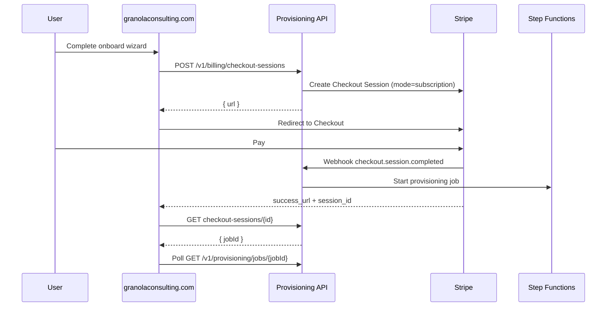

# HoneyGold Stripe subscription billing

HoneyGold **Business** is sold as a **Stripe subscription** (monthly or annual). **Starter** stays free via Cognito sign-in. **Enterprise** remains sales-assisted (no self-serve checkout).

## Architecture



Implementation lives in the **HoneyGold** repo (`infra/aws/cdk/lambdas/*`) and the marketing funnel (`js/honeygold-onboard.js`).

## Stripe Dashboard setup

1. Create a **Product** — e.g. `HoneyGold Business`.
2. Create **Prices** (recurring):
   - Monthly — €699 / month (EUR; create Prices with `currency: eur` in Stripe)
   - Annual — 10% discount vs 12× monthly (e.g. €7,549 / year)
3. Copy Price IDs (`price_…`) for CDK context:
   - `stripePriceBusinessMonthly`
   - `stripePriceBusinessAnnual`
4. Store API keys in AWS Secrets Manager secret `honeygold/stripe` (JSON):

```json
{
  "secretKey": "sk_live_…",
  "webhookSecret": "whsec_…"
}
```

Use a [restricted API key](https://docs.stripe.com/keys/restricted-api-keys) in production when possible.

5. Add a **Webhook** endpoint pointing at the stack output `StripeWebhookUrl`:
   - Event: `checkout.session.completed`
6. Enable **Customer Portal** in Stripe Dashboard (for payment method / cancel / upgrade).

## Deploy (HoneyGold CDK)

From `~/Documents/honeygold/infra/aws/cdk`:

```bash
npm install
npm run build
cdk deploy HoneyGoldProvisioningControlStack \
  -c stripePriceBusinessMonthly=price_XXXX \
  -c stripePriceBusinessAnnual=price_YYYY \
  -c requireStripeCheckout=true
```

Optional contexts:

| Context | Purpose |
| ------- | ------- |
| `checkoutSuccessUrl` | Default `https://www.granolaconsulting.com/honeygold-checkout-success.html` |
| `checkoutCancelUrl` | Default `honeygold-onboard.html?checkout=canceled` |
| `requireStripeCheckout=true` | Blocks direct `POST /v1/provisioning/jobs` for Business |
| `allowSkipCheckout=true` | Dev only: `skipCheckout: true` on checkout API |

## API endpoints

| Method | Path | Purpose |
| ------ | ---- | ------- |
| `POST` | `/v1/billing/checkout-sessions` | Create subscription Checkout Session |
| `GET` | `/v1/billing/checkout-sessions/{checkoutId}?session_id=cs_…` | Poll payment + resolve `jobId` |
| `POST` | `/v1/billing/webhook` | Stripe webhooks (server-to-server) |
| `POST` | `/v1/billing/portal` | Customer Portal session `{ stripeCustomerId, returnUrl? }` |

Checkout request body matches the provisioning job payload plus `billingInterval`: `"monthly"` | `"annual"`.

## Marketing site

- `honeygold-onboard.html` — set `HG_BILLING_ENABLED = true` and `HG_ONBOARD_API_BASE`
- Business **Review** step — compact monthly/annual choice, then **Continue to payment** → Stripe → provisioning UI
- Set `HG_BILLING_ENABLED = false` to restore direct deploy (e.g. demos with mock API)

## Testing

Use Stripe **Test mode** keys in the secret and test Price IDs. Test card: `4242 4242 4242 4242`.

Forward webhooks locally:

```bash
stripe listen --forward-to https://YOUR_API/v1/billing/webhook
```

## Related

- [HoneyGold onboarding](./honeygold-onboarding.md) — Phase 4 billing hook
- [Terms](../honeygold-terms.html) — subscription renewal language
