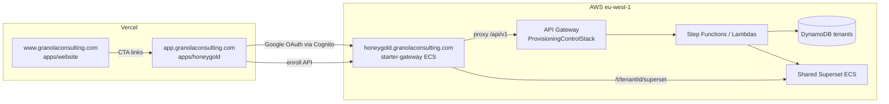

# Project structure

Granola Consulting ships as **two git repositories** in one workspace folder.

## Workspace layout

```
www.granolaconsulting.com/                 ← monorepo (this repo)
├── apps/
│   ├── website/                         → www.granolaconsulting.com
│   ├── honeygold/                       → app.granolaconsulting.com
│   └── admin/                           → admin.granolaconsulting.com
├── docs/                                → ops & architecture notes (this folder)
├── honeygold/                           → nested backend repo (separate .git)
│   ├── apps/
│   │   ├── starter-gateway/             → ECS: edge proxy, onboarding, MCP API
│   │   ├── hg-mcp/                      → Superset REST MCP tools
│   │   ├── mcp-router/                  → MCP tool routing / metering
│   │   ├── admin-console/               → legacy admin SPA (superseded by apps/admin)
│   │   ├── local-control-plane/         → local dev provisioning API
│   │   └── embedded-host/               → Business / embedded-host stack (local)
│   ├── infra/
│   │   ├── aws/cdk/                     → TypeScript CDK (production AWS)
│   │   └── starter/                     → Docker compose configs, Superset seeds
│   ├── e2e/                             → Playwright tests (local + prod)
│   ├── connectors/honeygold-mcpb/       → Claude Desktop .mcpb connector
│   ├── scripts/                         → deploy, e2e, tenant ops
│   └── docs/                            → backend runbooks
└── README.md
```

## Repositories

| Repo | GitHub | What it contains |
|------|--------|------------------|
| **Monorepo** | [harinathselvaraj/granolaconsulting](https://github.com/harinathselvaraj/granolaconsulting) | Vercel static apps: marketing, product sign-in/onboard, admin console |
| **HoneyGold backend** | [harinathselvaraj/honeygold](https://github.com/harinathselvaraj/honeygold) | Gateway, Superset pool, CDK, Lambdas, MCP, e2e |

`honeygold/` is listed in the monorepo `.gitignore`. Commit backend work inside `honeygold/`:

```bash
cd honeygold
git status
git add … && git commit && git push origin main
```

Clone both (typical setup):

```bash
git clone https://github.com/harinathselvaraj/granolaconsulting.git www.granolaconsulting.com
cd www.granolaconsulting.com
git clone https://github.com/harinathselvaraj/honeygold.git honeygold
```

## Production domains

| Domain | Platform | Source path | Purpose |
|--------|----------|-------------|---------|
| `granolaconsulting.com` / `www` | Vercel | `apps/website` | Marketing, blog, product pages |
| `app.granolaconsulting.com` | Vercel | `apps/honeygold` | Sign-in, onboard, legal pages |
| `admin.granolaconsulting.com` | Vercel | `apps/admin` | Internal tenant admin (Vite SPA) |
| `honeygold.granolaconsulting.com` | AWS ECS | `honeygold/apps/starter-gateway` | Starter gateway, Superset proxy, onboarding UI |

## Request flow (Starter sign-up)



1. User lands on **marketing** (`apps/website`) or **product app** (`apps/honeygold/sign-in`).
2. Google sign-in uses **Cognito** (configured in `sign-in.html` + `honeygold-signin.js`).
3. **Enroll** creates tenant + API key via provisioning API (proxied through gateway).
4. User completes **onboarding** on gateway (`/t/{tenantId}/onboarding`) or Vercel (`/onboard?phase=progress`).
5. **Provision Lambda** creates Postgres schema, Superset role, example data.
6. User opens **Superset welcome** at `/t/{tenantId}/superset/welcome/`.

## Monorepo apps (detail)

### `apps/website` — Marketing

- Static HTML + `public/js/custom.js` (`PRODUCT_DETAILS`, `BLOG_POSTS`, pricing).
- Vercel project: **granola-website**
- `vercel.json`: clean URLs, product/blog rewrites, legacy `.html` redirects.

### `apps/honeygold` — Product app

- Sign-in (`honeygold-signin.js`), onboard wizard (`honeygold-onboard.js`).
- Embeds AWS URLs in `sign-in.html` / `onboard.html` (`HG_*` globals).
- Vercel project: **granola-honeygold**
- Root directory in Vercel dashboard: `apps/honeygold` (deploy from **monorepo root** — see [deployment.md](deployment.md)).

### `apps/admin` — Admin console

- Vite + TypeScript SPA; Cognito auth; calls provisioning admin API.
- Vercel project: **granola-admin**
- Build env: `VITE_ADMIN_API_BASE`, `VITE_COGNITO_*` (see `apps/admin/.env.example`).
- Serves `public/internal/hg-seed/seed_starter_examples.py` for SharedSuperset bootstrap.

## HoneyGold backend (detail)

### `apps/starter-gateway`

Python FastAPI service behind ALB. Handles:

- Tenant path routing (`/t/{tenantId}/…`)
- Onboarding pages + smooth progress UI
- Cognito session / `complete-session`
- Proxy to provisioning API (`/api/v1`)
- MCP HTTP surface for Claude connector

### `infra/aws/cdk`

CloudFormation stacks (eu-west-1):

| Stack | Role |
|-------|------|
| `HoneyGoldSecretsStack` | Secrets Manager references |
| `HoneyGoldStorageStack` | DynamoDB, S3 |
| `HoneyGoldStarterFoundationStack` | VPC, RDS, shared Postgres |
| `HoneyGoldCognitoStarterStack` | User pool, Google IdP |
| `HoneyGoldProvisioningControlStack` | API Gateway, Lambdas, Step Functions |
| `HoneyGoldSharedPoolStack` | Gateway ECS, MCP router, Shared Superset ECS |

See `honeygold/infra/aws/cdk/README.md` for deploy order and scripts.

## What to edit for common changes

| Change | Where |
|--------|--------|
| Marketing copy, blog, pricing | `apps/website/public/js/custom.js` |
| Sign-in / enroll UX | `apps/honeygold/public/js/honeygold-signin.js` |
| Onboard wizard (Vercel) | `apps/honeygold/public/js/honeygold-onboard.js` |
| Onboard progress (gateway) | `honeygold/apps/starter-gateway/onboarding_page.py` |
| Welcome email content | `honeygold/infra/aws/cdk/lambdas/lib/email-templates.ts` |
| Starter MCP limits | `honeygold/infra/aws/cdk/lib/plan-profiles.ts` + `apps/website/public/js/custom.js` |
| Admin user list / delete | `apps/admin/src/` |
| Superset seed / examples | `honeygold/infra/starter/superset/` + CDK `config/` |
